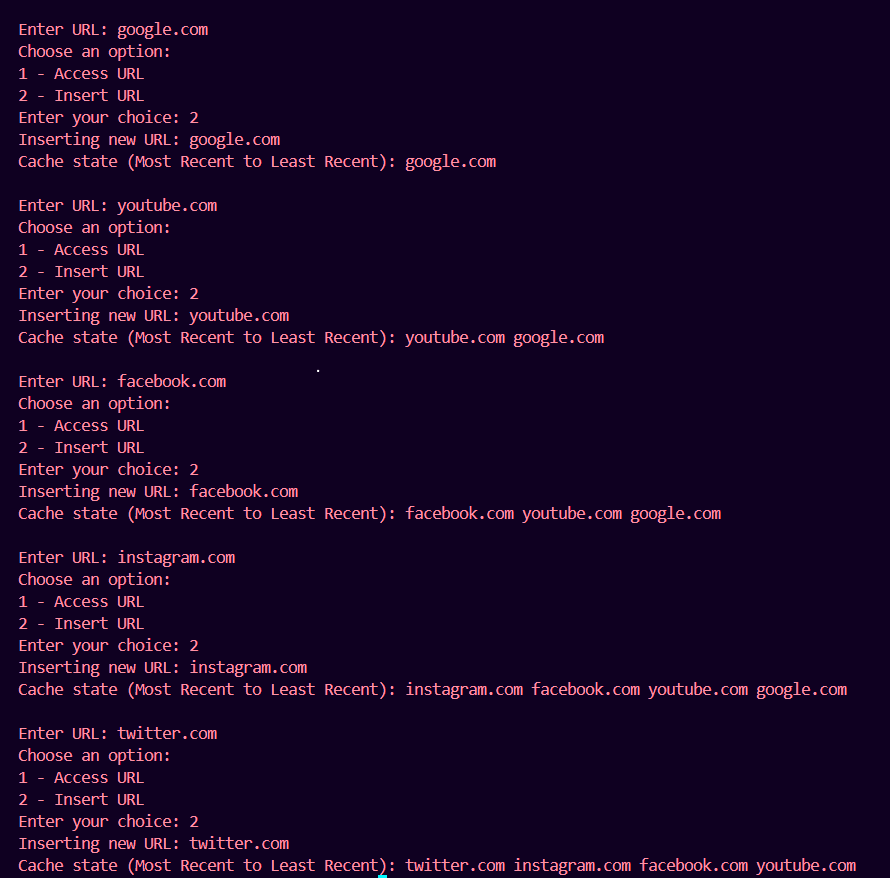

# LRU Cache Implementation  

## Introduction  
This project implements an image processing cache using the Least Recently Used (LRU) technique. It utilizes a Doubly Linked List and a Hash Map in C++ to efficiently manage recently accessed images. The cache stores frequently used image URLs and automatically evicts the least recently used ones when full.
The application is developed in C++ with OpenCV to optimize image processing by reducing redundant operations. This approach enhances performance by caching previously processed images, minimizing computation time, and improving overall efficiency.

## Features  
1) Developed a C++ application using OpenCV for efficient image processing and avoiding redundant
 processing using a LRU Cache(Least Recently Used) 
2) Reduces 50% of image processing time using caching technique having O(1) lookup time for
 already processed images  
3) Integrated with OpenCV for real time image processing(greyscale conversion). Additional
 processing features such as edge detection, various types of filters can be added as future
 additions to the application.  

## Technologies Used  
- C++  
- Data Structures (HashMap, Doubly Linked List)
- OpenCV
- Image Processing

## How to Run  
1️. Clone the repo: 
https://github.com/shwetakul2005/LRU-Cache-Project.git 

2️. Compile & Run:  
g++ lru_cache.cpp -o lru && ./lru  # For Linux/Mac
g++ lru_cache.cpp -o lru.exe && lru.exe  # For Windows

3️. Enter URLs to insert or access  

## Demo 

## Future Enhancements  
🔹 Add GUI using Tkinter or PyQt  
🔹 Implement a Web API using Flask  

